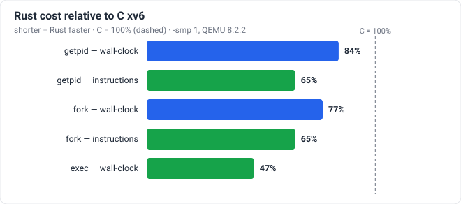
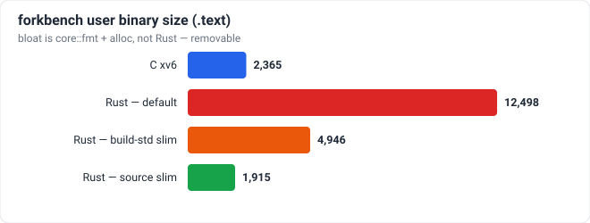

# xv6-riscv Rust Rewrite

A complete rewrite of the xv6-riscv teaching operating system kernel in **Rust**, leveraging Rust's memory safety, ownership model, and zero-cost abstractions to eliminate C memory bugs while maintaining identical behavior and performance characteristics.

## Overview

This project is a faithful Rust reimplementation of [xv6-riscv](https://github.com/mit-pdos/xv6-riscv), the RISC-V port of MIT's xv6 teaching operating system. The original xv6 was written in ANSI C; this version uses Rust's powerful type system to provide compile-time guarantees against common kernel bugs like use-after-free, double-free, buffer overflows, and data races.

### Why Rust?

| Feature | Benefit for Kernel Development |
|---------|--------------------------------|
| **No runtime/GC** | Direct hardware control, predictable latency |
| **Borrow checker** | Compile-time prevention of memory safety bugs |
| **Ownership model** | Clear resource lifetime management |
| **Zero-cost abstractions** | Performance matching C |
| **Type safety** | Typed addresses (`PhysAddr`, `VirtAddr`) prevent mixing |
| **Rich ecosystem** | `riscv`, `tock-registers`, `embedded-hal` crates |

### Compatibility

- **Binary compatible**: Same syscall numbers, same ELF format for user programs
- **Disk compatible**: Same FS layout (can mount C xv6 `fs.img`)
- **Test compatible**: All existing usertests pass unchanged

## Performance

Measured against the original C kernel (root `Makefile` build, `-O`) on the same
host, QEMU 8.2.2 `-machine virt`, `-smp 1`. Two workloads, both using a
difference method (`T(2N) − T(N)`) to cancel fixed overhead: a `getpid()` loop
(cheapest syscall — trap entry/dispatch/exit) and `fork`/`exec` loops (a heavy
proc + address-space path). See [`docs/perf-c-vs-rust.md`](docs/perf-c-vs-rust.md)
for method, raw numbers, and reproduction.



On every path measured the Rust rewrite is *leaner* — a tighter trap/dispatch
path and `-O3` (vs C's `-O`). Instruction counts are deterministic under
`-icount shift=0` (identical across runs).

| Path | Metric | C | Rust | Rust vs C |
|------|--------|--:|-----:|----------:|
| `getpid` | wall-clock | 18.59 µs | 15.68 µs | 0.84× |
| `getpid` | instructions | ~1040 | ~680 | 0.65× |
| `fork`+`wait` | wall-clock | 949 µs | 731 µs | 0.77× |
| `fork`+`wait` | instructions | ~1.15M | ~0.75M | 0.65× |
| `fork`+`exec`+`wait` | wall-clock | 3952 µs | 1845 µs | 0.47× |

The trade-off is static footprint: a Rust user binary starts ~5× larger than C.
That bloat is **not** intrinsic to Rust — a do-nothing program (`nop.rs`) is 32
bytes — it comes from `core::fmt` (`println!`) and `alloc` (`args()`,
`init_heap`). `build_rust_users.sh` builds the user crate with `-Z build-std` +
`panic=immediate-abort`, which roughly halves every binary with no source
changes (usertests still 17/17); avoiding `println!`/`alloc` in a program (see
`forkbench_slim.rs`) shrinks it below the C equivalent.



> Caveat: this compares two *implementations*, not two languages, and QEMU
> wall-clock is emulation-bound (the icount figures are the emulation-independent
> ones). FS-heavy workloads beyond `exec` are not yet covered.

## Quick Start

### Prerequisites

- **Nightly Rust** (edition 2024 + unstable features; `rustc 1.99.0-nightly` is known-good):
  `rustup target add riscv64imac-unknown-none-elf`
- RISC-V cross toolchain: `riscv64-unknown-elf-gcc` (linker, assembler for `arch/*.S`, and host `gcc` to build `mkfs`)
- QEMU ≥ 7.2: `qemu-system-riscv64` (`-machine virt`)

> `riscv64imac-unknown-none-elf` is the **only** target actually used — for both
> the kernel and the user programs. Ignore stale mentions of `riscv64gc-*` or
> `*-linux-gnu` elsewhere in the docs. `.cargo/config.toml` sets the linker and
> `rustflags` per target but sets **no default target**, so `--target
> riscv64imac-unknown-none-elf` must be passed to every `cargo` invocation.

### Building & Running (development)

Prefer the scripts — they build in the correct order and also (re)build the C
`mkfs` and repack `fs.img`:

```bash
./run_usertests.sh      # build kernel + users, repack fs.img, boot QEMU
./build_rust_users.sh   # rebuild ONLY the Rust user programs + repack fs.img
```

Manual equivalents (mind the build order below):

```bash
# 1. User programs first — each user/src/bin/*.rs is one program.
cargo build --release --target riscv64imac-unknown-none-elf -p xv6-user
# copy release binaries to the user/_<name> paths mkfs expects (see build_rust_users.sh)
cp target/riscv64imac-unknown-none-elf/release/{sh,ls,cat,init} user/   # -> user/_sh etc.

# 2. Kernel SECOND. init is embedded into the kernel image at compile time via
#    include_bytes!("../../user/_init") (kernel/src/elf.rs). The very first
#    process (userinit) runs THIS embedded copy, NOT the one in fs.img — so any
#    change to init (or user-lib code it links) needs BOTH user and kernel
#    rebuilt, in that order, or the running init will be stale.
cargo build --release --target riscv64imac-unknown-none-elf -p xv6-kernel

# 3. mkfs is C (host gcc); repack the filesystem image QEMU boots.
gcc -Wno-unknown-attributes -I. -o mkfs/mkfs mkfs/mkfs.c
./mkfs/mkfs fs.img README user/_cat user/_echo user/_init user/_sh ...

# 4. Boot (single hart while SMP bring-up is in progress).
qemu-system-riscv64 -machine virt -bios none \
  -kernel target/riscv64imac-unknown-none-elf/release/xv6-kernel \
  -m 128M -smp 1 -nographic -global virtio-mmio.force-legacy=false \
  -drive file=fs.img,if=none,format=raw,id=x0 \
  -device virtio-blk-device,drive=x0,bus=virtio-mmio-bus.0
```

The root `Makefile` builds the **original C kernel** (`make qemu`), not the Rust
rewrite — use it only for the C reference build or to build `mkfs`.

### Testing

```bash
# Host unit tests for a crate
cargo test -p xv6-kernel        # (or xv6-user-lib)

# Integration test: boots QEMU, runs usertests, diffs output
cargo test --test integration
```

## Architecture

See [docs/architecture.md](docs/architecture.md) for a detailed architecture overview.

## Migration from C xv6

See [docs/migration.md](docs/migration.md) for a guide on porting C xv6 code to Rust.

## Project Structure

```
xv6-rust/
├── kernel/                 # Kernel crate (no_std)
│   ├── src/
│   │   ├── arch/           # RISC-V architecture specifics
│   │   ├── mm/             # Memory management
│   │   ├── fs/             # File system
│   │   ├── proc/           # Process management
│   │   ├── sync/           # Synchronization primitives
│   │   ├── drivers/        # Device drivers
│   │   ├── syscall/        # System call handling
│   │   ├── trap/           # Trap handling
│   │   └── lib.rs          # Crate root
│   ├── Cargo.toml
│   └── memory.x            # Linker script
├── user/                   # User-space programs (std)
│   ├── src/bin/            # Each program as binary (sh, ls, cat, etc.)
│   ├── src/lib.rs          # User library (ulib equivalent)
│   └── Cargo.toml
├── user-lib/               # Shared user library
├── xtask/                  # Build automation
├── Cargo.toml              # Workspace root
└── docs/
    ├── architecture.md     # Architecture documentation
    └── migration.md        # Migration guide
```

## License

MIT License - see [LICENSE](LICENSE) for details.

Based on xv6-riscv by MIT (Frans Kaashoek, Robert Morris, et al.)